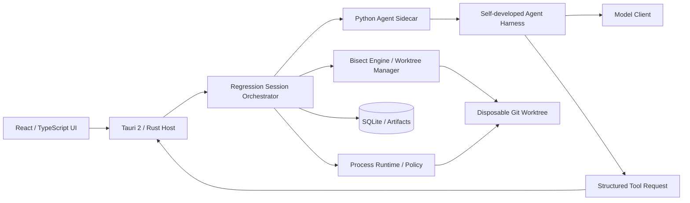

# Regression Agent 技术方案 v2

> 状态：待立项评审  
> 版本：v2.0  
> 原始方案：`C:\Users\yjd13\Downloads\regression_agent_technical_proposal_updated.md`  
> 本版目标：在保留原产品方向的前提下，明确控制权、运行边界、状态模型和 MVP 验收条件。

## 1. 项目定位

基于 **Axis** 二次开发一个专门用于定位代码回归的桌面工具。

产品只解决一个核心问题：

> 在用户提供已知 Good Commit、Bad Commit 和 Bug 描述后，可靠地定位引入回归的 commit，并给出可以复查的证据。

软件分为两层：

1. **确定性的 Git 产品层**：Commit Graph、Diff、Worktree、Visual Bisect、Manual GOOD/BAD/SKIP。
2. **可选的 Agent 增强层**：生成测试方案、解释执行结果、处理模糊情况、分析 First Bad Commit。

即使模型不可用，用户仍然能够完成完整的手动 Bisect 流程。

### 1.1 核心价值

- 将 Git Bisect、测试执行、证据收集和代码分析放进一个连续工作流。
- 不修改用户当前工作区，不打断正在进行的开发。
- 自动化可以自动化的步骤，同时保留人工确认和接管能力。
- 最终结论不是只有一个 commit，而是带有命令、输出、Diff 和判断依据的 Regression Report。

### 1.2 第一阶段不做

- 自动修复 Bug
- 自动提交、推送或创建 PR
- Issue / Code Review Agent
- 多 Agent 协作
- 跨会话 Memory、Skill 系统和复杂 Todo 系统
- 通用 Coding Agent
- 在未经批准的情况下访问网络
- 将 Worktree 宣称为安全沙箱
- 第一阶段同时支持 Windows、macOS、Linux

第一阶段采用 **Windows-first**。跨平台支持在核心流程稳定后单独验收。

---

## 2. 核心设计原则

### 2.1 Rust Host 是唯一流程控制者

Rust Host 负责 Session、Worktree、Bisect、进程、权限、持久化和取消。

Python Agent 只负责局部推理，不直接决定或修改全局 Bisect 状态。

> **Workflow 决定流程怎样前进，Agent 决定局部问题怎样判断。**

### 2.2 Manual、Assisted、Autonomous 共用一个状态机

三种模式的区别只是“Verdict 由谁提供”，而不是维护三套流程：

| 模式 | Verdict 来源 | 是否自动推进 |
| --- | --- | --- |
| Manual | 用户 | 用户确认后推进 |
| Assisted | Agent 建议，用户确认 | 用户确认后推进 |
| Autonomous | 确定规则优先，Agent 处理模糊情况 | 满足策略后自动推进 |

### 2.3 确定规则优先于模型判断

优先把 Bug 转换成可重复执行的 `OracleSpec`，然后由确定性 Workflow 执行。

只有下列情况调用模型：

- 首次探索仓库并生成 OracleSpec
- 命令结果不能由确定规则判断
- 不同历史版本需要调整测试方法
- Bisect 完成后的 Diff 分析

### 2.4 证据与结论分离

命令退出、超时、构建失败是**执行事实**；GOOD/BAD/SKIP 是基于事实形成的**领域判断**。

二者必须分别建模，不能用“非零退出码等于 BAD”代替 Oracle。

### 2.5 Worktree 是 Git 隔离，不是安全沙箱

Worktree 可以避免 checkout 影响用户当前分支，但其中运行的程序仍然拥有当前用户进程的系统权限。

第一阶段应明确其安全边界，不对任意不可信仓库承诺强沙箱能力。

---

## 3. 总体架构



### 3.1 组件职责

| 组件 | 负责 | 不负责 |
| --- | --- | --- |
| React UI | 展示、输入、人工确认、取消和恢复入口 | Git 状态推进、模型推理 |
| Rust Host | Session 编排、Git、Worktree、进程、Policy、SQLite、Sidecar 生命周期 | 回归语义推理 |
| Python Sidecar | Agent Loop、模型调用、OracleSpec 生成、模糊结果分析、报告推理 | 直接推进 Bisect、直接管理 Worktree |
| SQLite | 产品状态、事件索引、执行记录、Evidence 元数据 | API Key、超大 stdout 全文 |
| Artifact Store | 完整 stdout/stderr、Diff、报告附件 | Session 状态真相源 |

Rust Host 是全局状态的单一真相源。Python Sidecar 崩溃不应破坏 Manual 模式，也不应令 Git 状态无法恢复。

---

## 4. 核心领域模型

### 4.1 Session 状态

```text
CREATED
  ↓
VALIDATING_ENDPOINTS
  ↓
PREPARING_WORKTREE
  ↓
PREPARING_ORACLE
  ↓
BISECTING
  ↓
VERIFYING_CULPRIT
  ↓
ANALYZING
  ↓
COMPLETED

旁路状态：
WAITING_USER / CANCELLED / FAILED / AMBIGUOUS / INTERRUPTED
```

要求：

- 每次状态变更先持久化，再更新 UI。
- 每个状态必须定义允许的命令和合法的下一状态。
- Cancel 必须可从长时间运行状态进入，并终止对应进程树。
- 应用重启后，`INTERRUPTED` Session 可以清理或从最近稳定检查点恢复。

### 4.2 Commit Verdict

```python
class CommitVerdict:
    result: Literal[
        "bug_absent",      # 映射为 GOOD
        "bug_present",     # 映射为 BAD
        "untestable",      # 映射为 SKIP
        "inconclusive",    # 不推进 Bisect
    ]
    evidence_level: Literal["deterministic", "strong", "weak"]
    reason_code: str
    summary: str
    evidence_ids: list[str]
```

不使用模型自报的 `0.93` 之类精确小数作为可信度。UI 展示证据等级及其来源。

### 4.3 Culprit Result

Bisect 结果不能假设永远存在唯一 commit：

```python
class CulpritResult:
    kind: Literal["exact", "ambiguous", "aborted"]
    commit: str | None
    candidates: list[str]
    reason: str
```

当连续 SKIP 覆盖关键区间时，系统应返回 `ambiguous`，不能伪造唯一 First Bad Commit。

---

## 5. Regression Oracle

Oracle 回答：

> 当前 commit 是否已经出现目标回归？

### 5.1 OracleSpec

```json
{
  "version": 1,
  "setup": [
    {
      "program": "python",
      "args": ["-m", "pip", "install", "-e", "."],
      "timeout_ms": 300000
    }
  ],
  "probe": {
    "program": "python",
    "args": ["-m", "pytest", "tests/test_auth.py", "-q"],
    "timeout_ms": 120000
  },
  "classifier": {
    "kind": "exit_code_and_pattern",
    "good_exit_codes": [0],
    "bad_patterns": ["login returns 500"],
    "skip_exit_codes": [125]
  },
  "retries": 2,
  "working_directory": "."
}
```

限制：

- `working_directory` 必须是 Session Worktree 内的相对路径。
- 默认不通过系统 Shell 解析命令字符串。
- `program + args` 由 Rust Process Runtime 执行。
- OracleSpec 在 Bisect 开始后冻结；修改必须生成新 revision 并重新验证端点。

### 5.2 Endpoint Validation

正式 Bisect 前必须验证：

1. Good Commit 能执行同一 Oracle，结果为 `bug_absent`。
2. Bad Commit 能执行同一 Oracle，结果为 `bug_present`。
3. 两端使用相同 OracleSpec revision。
4. 若结果不稳定，先进入 Flaky 处理，不能开始 Bisect。

### 5.3 Flaky 处理

- OracleSpec 可以配置重复次数。
- 重复结果不一致时返回 `inconclusive`。
- Assisted 模式请求用户确认。
- Autonomous 模式达到重试上限后暂停或标记 `untestable`；具体策略由 Session 配置决定。
- 不允许 Agent 在没有证据的情况下把基础设施错误标记为 BAD。

---

## 6. 核心 Workflow

```text
用户选择 Repository / Good / Bad
          ↓
Rust 校验 commit、仓库状态与可达关系
          ↓
创建 Session 和 Disposable Worktree
          ↓
用户提供 OracleSpec，或 Agent 在 Bad Commit 上生成候选 OracleSpec
          ↓
在 Good / Bad 两端验证并冻结 OracleSpec
          ↓
Rust Bisect Engine 选择待测 commit
          ↓
Process Runtime 执行 Oracle
          ↓
确定规则分类
    ├─ 明确 → CommitVerdict
    └─ 模糊 → Agent 分析 → CommitVerdict / WAITING_USER
          ↓
Rust 应用 GOOD / BAD / SKIP 并持久化
          ↓
继续直到 Exact / Ambiguous / Aborted
          ↓
复验 culprit 与相关 parent
          ↓
Agent 分析 Diff 和相关代码
          ↓
生成 Regression Report
```

### 6.1 为什么不让 Agent 自己运行 `git bisect good/bad`

- Manual、Assisted、Autonomous 可以共用同一套状态机。
- UI、SQLite 和 Git 状态不会出现两个真相源。
- 可以安全取消、恢复和重放。
- Git 写操作全部集中在 Rust Host，Policy 更容易验证。
- Agent 输出错误时不会直接破坏 Bisect 状态。

---

## 7. Tool 设计

第一阶段不给 Agent 一个无限制 Shell，而是提供受控能力：

```text
read_file
search_code
git_show
git_diff
list_changed_files
run_process
run_oracle
```

### 7.1 run_process

```python
run_process(
    program: str,
    args: list[str],
    cwd: str = ".",
    timeout_ms: int = 60_000,
)
```

返回：

```json
{
  "execution_id": "exec_01",
  "status": "exited",
  "exit_code": 1,
  "stdout_preview": "...",
  "stderr_preview": "...",
  "stdout_artifact": "artifact_17",
  "stderr_artifact": "artifact_18",
  "duration_ms": 1832,
  "truncated": true
}
```

### 7.2 Git 能力边界

Agent 允许使用只读 Git 能力：

- show
- diff
- log
- rev-parse
- diff-tree / changed files

Agent 不允许直接执行：

- bisect good / bad / skip / reset
- checkout / switch / reset
- worktree add / remove
- commit / push / fetch
- config 写入

这些操作只能由 Rust Host 的领域服务执行。

### 7.3 通用 Shell

通用 Shell 不属于 MVP 必备能力。

如果后续加入：

- 默认关闭。
- 每次调用必须经过 Rust Policy。
- 使用显式权限和 UI 审批事件，不能在 Sidecar 中调用 `input()`。
- 必须记录完整命令、审批来源、执行身份和输出 Artifact。

---

## 8. Process Runtime 与 Policy

执行链：

```text
Agent Tool Request
      ↓
Rust Capability Broker
      ↓
Session / Path / Program / Network / Timeout Policy
      ↓
Process Runtime
      ↓
Disposable Worktree
      ↓
Structured ExecutionResult + Trace
```

第一阶段至少控制：

| 范围 | 策略 |
| --- | --- |
| cwd | 只能位于当前 Session Worktree |
| 原始仓库 | Agent 和 Oracle 禁止写入 |
| Git 写操作 | 只允许 Rust BisectEngine / WorktreeManager |
| 网络 | 默认关闭策略；需要联网的 Setup 必须显式批准 |
| 环境变量 | 使用 allowlist，移除常见 Token 和 Secret |
| 超时 | 每个进程有强制 timeout |
| 进程树 | Cancel、Sidecar 退出和 App 退出时统一终止 |
| 输出 | Preview 限制，完整内容进入 Artifact Store |
| 后台进程 | MVP 默认禁止；后续加入受控 Job |
| Trace | 每次请求、审批、执行和结果都记录 |

注意：命令 allowlist 和环境变量清理不等于 OS 级沙箱。面向不可信仓库时，需要进一步采用容器、受限用户或平台级隔离。

---

## 9. Worktree 生命周期

Session Worktree 位于应用数据目录：

```text
<app-data>/regression-agent/sessions/<session-id>/worktree/
```

生命周期：

```text
校验目标路径
  ↓
git worktree add --detach <path> <bad-commit>
  ↓
验证 worktree registry 和 HEAD
  ↓
执行 Endpoint Validation / Bisect
  ↓
停止所有 Session 进程
  ↓
git bisect reset（如需要）
  ↓
检查 dirty / lock / active process
  ↓
由 Host 清理或保留供用户调查
```

要求：

- Session ID 与目录名由 Host 生成，不接收模型提供的路径。
- Worktree 使用 detached HEAD，不创建业务分支。
- 清理前必须确认没有活动进程。
- 异常退出后，下次启动执行 registry reconcile，而不是直接递归删除目录。
- 构建产物和未跟踪文件可能污染下一次 commit 判断；每轮必须执行明确的清洁策略。
- 依赖缓存应放在独立缓存目录，不能依赖前一 commit 遗留的构建状态。

---

## 10. Python Agent Harness

继续使用自研 Harness，不引入 LangGraph 或第二套 Agent 框架。

但不直接把当前 `gfpl_agent` 当作生产依赖，而是提取和重构需要的最小能力。

### 10.1 第一阶段保留

```text
Agent Loop
ModelClient interface
Tool Registry
Tool-call protocol integrity
Structured output validation
Retry
Context budget
Tracing events
```

### 10.2 第一阶段不接入

```text
TodoWrite
Subagent
Agent Teams
Memory
Skill Loading
Cron
MCP
通用文件写入
```

### 10.3 必须完成的重构

- 将固定全局 `SANDBOX_DIR` 改为每个 Session 注入的 Workspace。
- 将 `DeepseekClient` 抽象成 `ModelClient`，OpenAI 只是其中一个实现。
- Harness 不直接 `print()` 到 stdout，而是使用 EventSink；日志进入 stderr。
- Tool handler 不直接执行本地进程，而是向 Rust Host 发出 Tool Request。
- Permission 不使用终端 `input()`，改为异步 Approval Protocol。
- 模型非法 JSON、未知工具和 handler 异常必须形成匹配 `tool_call_id` 的失败结果。
- 每轮支持 Cancellation Token 和最大步骤、时间、Token、成本预算。

### 10.4 为什么采用短生命周期 Agent

每个 commit 的评价尽量使用独立、受限上下文：

- Session 状态和历史证据保存在 Rust / SQLite。
- Agent 只收到当前 commit、OracleSpec、必要的基线和最近观察。
- 不依赖一个超长对话记住整个 Bisect 过程。
- 大幅降低 Context Compaction、Memory 和上下文漂移的复杂度。

Bisect 完成后，再启动独立的 Culprit Analysis Agent。

---

## 11. Tauri 与 Python Sidecar 协议

通信采用 stdin/stdout 上的 JSON Lines。

约定：

- stdout 只允许输出协议消息。
- 日志写 stderr。
- 每条消息必须包含协议版本、Session ID、消息 ID 和顺序号。
- 大输出不直接放进 JSONL，而是保存为 Artifact 后传引用。
- 第一阶段每个活动 Session 启动一个 Sidecar，避免全局状态互相污染。

### 11.1 通用 Envelope

```json
{
  "protocol_version": 1,
  "session_id": "ses_123",
  "message_id": "msg_456",
  "seq": 17,
  "type": "agent.verdict",
  "timestamp": "2026-09-19T10:00:00Z",
  "payload": {}
}
```

### 11.2 Host → Sidecar

```text
host.hello
session.start
agent.evaluate_commit
agent.analyze_culprit
tool.result
approval.result
session.cancel
session.shutdown
```

### 11.3 Sidecar → Host

```text
sidecar.ready
agent.status
agent.text_delta
tool.request
approval.required
agent.oracle_spec
agent.verdict
agent.report
agent.error
```

### 11.4 Tool Request 示例

```json
{
  "protocol_version": 1,
  "session_id": "ses_123",
  "message_id": "msg_tool_1",
  "seq": 18,
  "type": "tool.request",
  "payload": {
    "tool_call_id": "call_9",
    "name": "search_code",
    "arguments": {
      "pattern": "refresh_token",
      "path": "src"
    }
  }
}
```

### 11.5 协议可靠性

- 启动时通过 `host.hello / sidecar.ready` 协商协议版本。
- Tool Request 使用 `tool_call_id` 关联唯一结果。
- Host 对每个 Session 维护单调递增 `seq`。
- 重复消息通过 `message_id` 幂等处理。
- 定义最大单行大小和输出背压。
- Sidecar 失联后 Host 将 Session 标记为 `INTERRUPTED`，不自动修改 Git 状态。

---

## 12. SQLite 与 Artifact Store

SQLite 由 Rust Host 单独写入。

### 12.1 最小表

```text
sessions
  id, repo_path, good_oid, bad_oid, mode, status,
  oracle_revision, worktree_path, created_at, updated_at

commit_evaluations
  id, session_id, commit_oid, verdict, evidence_level,
  reason_code, attempt, created_at

executions
  id, session_id, commit_oid, program, args_json,
  status, exit_code, duration_ms, stdout_artifact,
  stderr_artifact, started_at, finished_at

events
  session_id, seq, type, payload_json, created_at

artifacts
  id, session_id, kind, path, sha256, size, created_at

reports
  session_id, version, report_json, report_markdown, created_at
```

### 12.2 数据原则

- API Key 不进入 SQLite、Trace 或命令行参数。
- 路径持久化前规范化。
- stdout/stderr 完整文本进入 Artifact Store，SQLite 只保存引用和摘要。
- 每个 Verdict 必须引用至少一条 Evidence。
- Report 中的结论必须能追溯到 Evaluation、Execution 和 Diff Artifact。

---

## 13. UI 设计

```text
┌──────────────┬────────────────────┬────────────────────┐
│ Commit Graph │       Diff         │ Session Inspector  │
│              │                    │                    │
│ ● BAD        │ auth/service.py    │ Phase: BISECTING   │
│ │            │                    │ Current: 91acd3    │
│ ● TEST       │ - old code         │ Verdict: BAD       │
│ │            │ + new code         │ Evidence: Strong   │
│ ● GOOD       │                    │ Oracle rev: 3      │
├──────────────┴────────────────────┴────────────────────┤
│ Execution / Evidence                                  │
│ > python -m pytest tests/test_auth.py -q               │
│ exit=1 · 1 failed · 21 passed · 1.83s                  │
│ [View full stdout] [Confirm BAD] [Retry] [Cancel]      │
└───────────────────────────────────────────────────────┘
```

UI 必须提供：

- 当前 Phase、Commit 和 Bisect 区间
- OracleSpec 内容与 revision
- 每次命令、退出码、耗时和完整输出入口
- Verdict 来源：规则、Agent 或用户
- Assisted 模式的确认、驳回、重试和改判
- Cancel 和保留 Worktree 按钮
- Exact / Ambiguous / Aborted 的不同结果展示

Agent 未启用时隐藏 Agent 推理区域，但保留 Manual Bisect 和 Execution Evidence。

---

## 14. Regression Report

最终报告不是自由散文，而是结构化数据渲染结果。

```text
Session Summary
Good / Bad Commit
OracleSpec 与端点验证结果
Bisect Path
Exact Culprit 或 Ambiguous Candidates
Commit Message / Author / Timestamp
Changed Files
Regression Evidence
Suspicious Diff Hunks
Agent Analysis
Alternative Explanations
Suggested Investigation Points
Reproduction Commands
Known Limitations
```

Agent Analysis 必须明确区分：

- **事实**：Git、命令、测试和 Diff 直接提供的信息。
- **推理**：根据事实推断的可能原因。
- **未确认项**：还需要开发者验证的假设。

对于 merge commit，应明确分析所采用的 parent，不能默认只比较 `commit^`。

---

## 15. 项目目录

```text
regression-agent/
├── apps/
│   └── desktop/                       # Axis fork / React / Tauri
│       └── src-tauri/src/regression/
│           ├── session.rs
│           ├── bisect.rs
│           ├── worktree.rs
│           ├── process.rs
│           ├── policy.rs
│           ├── sidecar.rs
│           ├── store.rs
│           └── report.rs
├── agent/
│   └── regression_agent/
│       ├── loop.py
│       ├── model.py
│       ├── protocol.py
│       ├── registry.py
│       ├── oracle_builder.py
│       ├── evaluator.py
│       ├── culprit_analyzer.py
│       └── schemas.py
├── protocol/
│   ├── message.schema.json
│   ├── oracle.schema.json
│   └── report.schema.json
├── eval/
│   ├── fixtures/
│   └── cases/
├── docs/
│   ├── adr/
│   ├── architecture.md
│   ├── protocol.md
│   └── security-model.md
└── scripts/
    └── build-sidecar.*
```

---

## 16. MVP 范围

### 16.1 MVP-0：Manual Foundation

- 跑通并固定 Axis fork
- Visual Bisect
- 手动 GOOD / BAD / SKIP
- Disposable Worktree
- Session 状态和 SQLite
- Cancel、异常清理和恢复提示

### 16.2 MVP-1：Deterministic Automation

- 用户填写 OracleSpec
- Endpoint Validation
- 自动执行 Oracle
- 自动推进 Bisect
- Exact / Ambiguous / Aborted
- 完整 Evidence 和报告

此阶段不需要模型即可实现高价值闭环。

### 16.3 MVP-2：Assisted Agent

- Python Sidecar 和版本握手
- Agent 生成 OracleSpec 候选
- Agent 对 Inconclusive 结果给出建议
- 用户确认 Verdict
- Agent 分析 Culprit Diff

### 16.4 MVP-3：Autonomous Agent

- 经过验证的 OracleSpec 可自动运行
- 确定规则优先
- 模糊情况按照策略重试、SKIP 或暂停
- 成本、步骤和时间预算
- 全流程 Eval 达标后再默认开放

---

## 17. 开发顺序

```text
0. 编写 ADR：控制权、Sidecar、Process Runtime、状态所有权
1. Fork Axis，固定 upstream commit，跑通现有测试
2. 抽取并验证 Axis 的 Bisect / Worktree 接口
3. 实现 RegressionSession 状态机
4. 实现 Disposable Worktree 生命周期
5. 实现 SQLite、Event Log 和 Artifact Store
6. 实现 Process Runtime、取消和进程树清理
7. 实现 OracleSpec 与 Endpoint Validation
8. 完成无模型的 Deterministic Automation
9. 定义并测试 JSONL Protocol
10. 从现有 Harness 提取最小 Agent Runtime
11. 接入 Assisted 模式
12. 实现 Culprit Analysis 和结构化 Report
13. 增加 Autonomous 策略
14. 建立 Eval、Sidecar 打包和安装包测试
15. 跨平台适配
```

不应在 Manual、Session 和 Oracle 尚未稳定时，优先开发开放式 Autonomous Agent。

---

## 18. 验收标准

### 18.1 Manual 链路

- 不启动 Python Sidecar 也能完成完整 Bisect。
- 原始工作区的分支、未提交修改和 HEAD 不发生变化。
- GOOD/BAD/SKIP 操作可以在 UI、SQLite 和 Git 状态中一致重建。

### 18.2 Deterministic 链路

- Good/Bad 端点验证不通过时禁止开始 Bisect。
- 每个 commit 的判断都有命令、退出码和输出证据。
- 超时、命令不存在和构建失败不会被误判为 BAD。
- 连续 SKIP 时可以返回 Ambiguous Candidates。

### 18.3 Agent 链路

- Sidecar stdout 中每一行都是合法协议消息。
- 非法 Tool 参数不会导致 Sidecar 或 Host 崩溃。
- Assisted Verdict 未经用户确认不会推进 Bisect。
- Autonomous Verdict 只有满足策略阈值才会推进。
- Agent 崩溃后 Git 状态仍然可恢复，Manual 模式仍可继续。

### 18.4 生命周期

- Cancel 可以终止测试进程树。
- 应用异常退出后能够发现遗留 Session 和 Worktree。
- 清理不会删除用户原始仓库或非 Session 目录。
- API Key、Token 和常见 Secret 不出现在 Trace、Artifact 和 Report 中。

---

## 19. Eval Case

至少建立以下固定 Fixture 仓库：

1. 线性历史中的单一确定回归。
2. 中间 commit 无法构建，需要 SKIP。
3. SKIP 紧邻 culprit，只能返回 Ambiguous。
4. Flaky Test，多次执行结果不一致。
5. Oracle 命令不存在。
6. 超时并产生子进程。
7. Merge Commit 和 `--first-parent` 策略。
8. 文件名包含空格、中文和长路径。
9. Sidecar 在 Verdict 前崩溃。
10. App 在 Bisect 中途重启。
11. 仓库脚本尝试读取敏感环境变量。
12. 大 stdout/stderr 触发 Artifact 落盘。

核心指标：

```text
Exact Culprit Accuracy
False BAD Rate
False GOOD Rate
Ambiguous Detection Rate
Crash Recovery Success
Original Workspace Integrity
Evidence Completeness
Average Commands / Tokens / Duration
```

---

## 20. 主要风险与应对

| 风险 | 影响 | 应对 |
| --- | --- | --- |
| Axis 上游快速变化 | 二次开发持续冲突 | 固定 commit，隔离 regression 模块，定期批量同步 |
| Python Sidecar 跨平台打包 | 安装包复杂、启动失败 | Windows-first；CI 构建 target-specific binary |
| Worktree 被误认为沙箱 | 用户文件和 Secret 风险 | 明确安全模型；环境清理；后续接 OS 沙箱 |
| 测试环境跨 commit 变化 | 大量误判或 SKIP | Endpoint Validation；Setup/Probe 分离；Oracle revision |
| Agent 误判 | 推进错误导致假 culprit | 确定规则优先；Assisted 确认；证据可追溯 |
| Flaky 测试 | 二分结果不稳定 | 重复运行、Inconclusive、统计策略 |
| Sidecar/Host 双重状态 | UI 和实际 Git 不一致 | Rust 单一状态源；Agent 不执行 Git 状态写入 |
| 超大日志 | UI、模型和协议被淹没 | Preview + Artifact Store + 输出预算 |
| 私有代码上传模型 | 合规和隐私风险 | 显式告知；最小化上下文；可配置 Provider |

---

## 21. 第一阶段最终验收定义

第一阶段完成必须同时满足：

> **不开启 Agent 时，用户可以在 Disposable Worktree 中完成完整 Visual Bisect，并获得可恢复、可追溯的执行记录。**

以及：

> **开启 Agent 后，Agent 可以生成并验证 OracleSpec；Rust Host 使用同一状态机自动推进 Bisect；最终输出 Exact、Ambiguous 或 Aborted 结果，并生成带完整证据链的 Regression Report。**

达到上述标准后，再评估自动修复、PR、Issue、更多工具和跨平台强沙箱能力。

---

## 22. 与现有学习框架的关系

本项目沿用现有学习成果中的核心认知：

- Agent Loop 负责“模型 → Tool Call → Observation → 再推理”。
- Tool Schema 面向模型，Handler 面向环境。
- Permission、Tracing、Retry 和 Context 属于 Harness。
- 固定业务流程应写入 Workflow，而不是依赖模型在长对话中记住步骤。
- Worktree 隔离 working copy，但不隔离系统权限。

相关笔记：

- [[01_project_map/learn-claude-code/architecture]]
- `00_raw/learn-claude-code/s16_workflow_runtime/README.zh.md`

本项目不是把当前 `gfpl_agent` 原样嵌入 Axis，而是把其中已验证的机制提取为更小、可注入、可取消、可通过协议驱动的 Regression Agent Runtime。
